# claude-handoff



[](https://pypi.org/project/claude-handoff/)
[](https://pypi.org/project/claude-handoff/)
[](https://github.com/Vasilispapg/claude-handoff/actions/workflows/ci.yml)
[](https://pypi.org/project/claude-handoff/)
[](LICENSE)

**Turn any Claude Code session — even a crashed one — into a clean `handoff.md` another AI can continue from. And give Claude Code permanent project memory, distilled from your own history.**

```bash
chf
```

That's it. Your latest session becomes `handoff.md`: the conversation without
the noise, the files that changed, the commands that ran — opening with
instructions to the receiving assistant, so you can paste it straight into
Gemini, GPT, claude.ai, or a fresh Claude Code session with zero extra
prompting.


Claude Code stores every session locally as JSONL
(`~/.claude/projects/…/*.jsonl`), full of tool calls, tool results, thinking
blocks and system reminders. Existing exporters dump all of that into
markdown. `claude-handoff` instead produces a **handoff document** — and,
since it can read your *entire* history, a **project memory brief** too.

- **Zero dependencies.** Stdlib only, Python 3.9+. A nine-module package —
  also shipped as a generated single-file script you can `curl` and audit.
- **Deterministic by default.** No API call, no cost, works offline.
- **`--llm` when you want a real summary.** Claude, OpenAI or Gemini via
  your own API key — or `--llm claude-cli`, which runs your locally-installed
  Claude Code CLI on your existing Pro/Max plan: **no API key at all**.
- **Noise-free.** Drops tool results, thinking blocks, system reminders,
  subagent chatter, slash-command envelopes. Keeps user intent, assistant
  answers, files modified, commands run — including the files and commands
  of subagents (`agent-*.jsonl`), whose full transcripts stay behind
  `--include-sidechains`.
- **Project memory.** `chf --brief` distills a project's ENTIRE session
  history into one living brief — what this is, where things stand,
  decisions, fixes, conventions, and an ordered resume plan of open
  threads, every claim citing its session; `--install-brief-hook` injects
  it into every new Claude Code session, so Claude starts already knowing
  the project.
- **Safe to paste.** Secret-looking strings (API keys, tokens,
  `password=`…) are redacted from every output — the handoff you paste into
  a web chat is egress too. `--anonymize` goes further for public sharing.

---

## Prerequisites

| Requirement | Minimum | Check | Notes |
|---|---|---|---|
| Python | 3.9+ | `python3 --version` | The only hard requirement |
| Claude Code | any | `claude --version` | Only for `--llm claude-cli` (uses your Pro/Max login) |
| pipx *(recommended)* | any | `pipx --version` | `pip install pipx` — or use brew / plain pip |

No third-party Python packages, ever — everything runs on the standard library.

## Install

```bash
pipx install claude-handoff        # or: pip install claude-handoff
```

```bash
brew install Vasilispapg/tap/claude-handoff   # Homebrew
```

```bash
# or just grab the generated single-file build — stdlib-only, auditable:
curl -O https://raw.githubusercontent.com/Vasilispapg/claude-handoff/main/single/claude_handoff.py
python3 claude_handoff.py --list
```

Installing the package gives you two identical commands: `claude-handoff`
and the short alias **`chf`**. Tab completion:

```bash
eval "$(claude-handoff --completions zsh)"    # bash works too
```

---

## 60 seconds: pick your situation

**A session crashed, hit the usage limit, or you closed the terminal:**

```bash
chf -o clipboard
```

…then paste into claude.ai, ChatGPT, Gemini — or a fresh `claude` session.
Works on any old session; nothing needed to be installed *before* the crash.

**Moving work from Claude Code to another model:**

```bash
chf --fit 32k -o clipboard         # sized to the receiver's context window
```

**"Which session was it where we talked about CORS?"**

```bash
chf --list --grep "CORS"           # every match, with a 🔍 context preview
chf --grep "CORS"                  # or export the newest match directly
```

**Give Claude Code permanent memory of this project:**

```bash
chf --brief --llm claude-cli       # distill ALL sessions → one cited brief
chf --install-brief-hook           # every new session starts knowing it
```

**A real summary instead of the transcript (goal / decisions / state / next):**

```bash
chf --llm claude-cli               # your Claude Code login — no API key
```

**A claude.ai or ChatGPT web chat instead of a terminal session:**

```bash
chf conversations.json --list      # each app's data export works as input
chf conversations.json --name "webhook bug"
```

---

## Project memory (`--brief`)

Claude Code forgets everything between sessions — but the whole history is
on your disk. `chf --brief` reads **every** session of the current project
and writes one memory document to `~/.claude/briefs/<project>.md`:

- a factual **session timeline** + most-touched files (deterministic, free);
- with `--llm`, a **distilled memory** that opens with *what this is*
  (product, stack, current state) and *where things stand* (done / in
  flight / not started), then decisions with their why, fixed bugs,
  conventions — and *open threads* as an ordered resume plan, each with
  its concrete next action and a `[in flight]` / `[blocked]` /
  `[not started]` tag. Every bullet cites the session id it came from
  (`chf --name <id>` opens the source).


Per-session notes are cached, so refreshing after new sessions only pays
for the new ones — and a monster session (beyond ~120k chars) is
map-reduced *inside* the note, so the memory path never truncates:
nothing is silently dropped, at any size.

You can also curate what feeds the memory: `--exclude <id>` leaves a
session out (a duplicate, an experiment — bare `--exclude` opens a
numbered picker that remembers: the stored exclusions arrive
pre-selected with ✗ and typed numbers toggle, so you edit the set
instead of re-picking it), and `--keep first:2,last:20` windows a huge history to
the founding sessions plus a sliding recent window. Both are **sticky** —
stored in the brief's stamp, so hooks and later refreshes keep honoring
them until you change them (`--exclude none`, `--keep all`). And
`chf --brief -o clipboard` ships the current brief — distillation
included — straight to the clipboard, one paste away from handing your
project memory to another model.

The brief also goes beyond the project store: `chf --brief --grep X
-o -` distills a **thematic memory** (only the sessions that talked
about X), and `chf conversations.json --brief -o brief.md` builds
standing memory **from a claude.ai or ChatGPT export** — every
conversation, cited by its id. Both are exports by design (explicit
`-o` only) so they never overwrite the standing brief.

Running **graphify** (`pip install graphifyy`)? The two tools compose in
both directions, zero config. `chf --brief -o graphify` files the
current memory — distillation included — into `raw/`, graphify's ingest
folder, as ONE evolving `project-memory.md` carrying the frontmatter
graphify maps onto nodes; the next `/graphify --update` links your
decisions, fixes and open threads into the code's knowledge graph
(plain `chf -o graphify` files one session's handoff the same way, and
you get a heads-up if `raw/` isn't gitignored). In the other direction,
when `graphify-out/graph.json` exists the brief gains a free
`## Code map` section — nodes, communities, hub concepts, plus the
*knowledge* lines: `bridges:` (the strongest links crossing community
boundaries — where subsystems touch) and `flows:` (graphify's labeled
multi-node patterns) — so a new session starts knowing the code's
*structure*, not just its history. And the copies stay fresh on their
own: once `raw/project-memory.md` exists, every brief refresh (explicit
or hook) rewrites it — same for a `BRIEF.md` you `touch` at the repo
root when you want a plain, committable copy. Refresh-only, ever:
delete the file and nothing recreates it.

```bash
chf --install-brief-hook
```

installs two hooks: **SessionStart** injects the brief as context (Claude
starts already knowing your project — re-injected after `/compact` too),
**SessionEnd** auto-refreshes the factual part for free. **No LLM ever runs
from a hook**; the distilled part refreshes only when you say so. The brief
carries a freshness stamp, and when newer sessions or commits exist the
file and the injection don't just warn — they list them (session titles,
commit subjects), so a fresh session sees *what* changed, not merely that
something did. Fully local; redaction applies as everywhere.

→ Step-by-step mechanics, the honest cost table, and a full day-with-it
walkthrough: **[docs/GUIDE.md](docs/GUIDE.md)**.

## Make it automatic

```bash
chf --install-hook                 # SessionEnd + PreCompact → handoff to ~/.claude/handoffs/
chf --install-brief-hook           # SessionStart/End + PreCompact → project memory (above)
chf --install-skill                # /claude-handoff skill → Claude Code drives chf correctly
```

PreCompact matters: right before Claude Code compacts a long session's
context, both hooks snapshot state — the handoff preserves detail that
compaction is about to squeeze away, and the brief skeleton stays fresh
mid-session.

Both edit `~/.claude/settings.json` non-destructively, are idempotent, and
have matching `--uninstall-*` flags. Hook failures never break the host
session, and hooks never trigger LLM calls or create files on their own.

The third one is for Claude itself: `--install-skill` puts a
`/claude-handoff` skill into `~/.claude/skills/` (plus its trigger in
`~/.claude/CLAUDE.md`), so Claude Code knows the tool's grammar instead of
guessing — which session bare `chf` picks from inside a live session,
`claude-cli` (subscription) vs `claude` (API key), `--fit` for token
budgets, no interactive pickers from an agent shell. Idempotent, respects
a hand-written section, and `--uninstall-skill` removes both pieces
without touching anything else in either file.

---

## What the output looks like

```markdown
# Conversation handoff

> To the receiving assistant: … you are taking over …

## Session
- Project: /home/you/myapp (branch main)
- When: 2026-08-20 09:00 → 09:04
- Activity: 2 user messages, 2 assistant replies, 4 tool calls

## Files created / modified
- auth.py

## Commands run
- python -m pytest tests/test_auth.py -q

_🤖 2 subagent(s) contributed to the work above (--include-sidechains for their transcripts)._

## Conversation

_Condensed digest, every turn capped — verbatim messages with --full, a real summary with --llm._

- **🧑 User:** the login breaks on unicode passwords…
- **🤖 Assistant:** Found it — ascii encoding. Changed to utf-8, tests pass. _[4 tool calls]_
- 🔔 Agent "Update the docs" finished
```

Every turn is there, condensed to its lead — it's a summarize tool, not
an exporter. `--full` switches to classic verbatim messages, and `--llm`
replaces the digest with a real summary that read *everything*.

## Common commands

```bash
chf                                # latest session → handoff.md
chf -i                             # numbered picker; "1,3" or "2-4" merges several
chf --list                         # what sessions do I have? (title · first prompt)
chf --list --format json           # the same, machine-readable
chf --name "login bug"             # newest session whose title/prompt matches
chf "login bug"                    # same — a non-path argument is a name search
chf --grep "CORS"                  # newest session that *talked about* CORS
chf --grep CORS --grep auth        # …that talked about BOTH (AND)
chf a.jsonl b.jsonl                # several paths → ONE merged handoff
chf --project myrepo               # latest session of a specific project
chf path/to/session.jsonl -o -     # explicit file → stdout
chf -o clipboard                   # straight to the clipboard — go paste it
chf --full                         # verbatim messages instead of the digest
chf --last 5                       # only the last 5 user turns
chf --since 2h                     # only the last 2 hours of the session
chf --fit 32k                      # sized to fit a 32k-token context
chf --include-tools                # keep collapsed per-tool-call detail
chf --include-sidechains           # append full subagent transcripts
chf --anonymize                    # public-safe: ~ paths, no emails/IPs/username
chf --project myrepo --merge       # whole project in ONE handoff, oldest → newest
chf --format json -o session.json  # machine-readable handoff

# LLM summaries (goal / decisions / current state / next steps).
# --llm composes with EVERYTHING above — picker, --name/--grep/--project,
# --merge, --last/--since, clipboard, JSON… (only --fit stays
# deterministic-only, by design):
chf --llm claude-cli               # your Claude Code login — no API key
chf --llm ollama                   # local model — fully offline
chf --llm claude                   # Anthropic API   (ANTHROPIC_API_KEY)
chf --llm openai --model gpt-4o    # OpenAI API      (OPENAI_API_KEY)
chf --llm gemini --with-transcript # Google API      (GEMINI_API_KEY)
chf --llm claude-cli --focus "emphasize the API decisions"
chf --grep CORS --llm claude-cli   # find the session, then summarize it
chf -i --merge --llm claude-cli -o clipboard   # pick several → ONE summary, pasted
chf --since 2h --llm claude-cli    # summarize just the last two hours

# project memory:
chf --brief                        # free factual brief (timeline + files)
chf --brief --llm claude-cli       # + distilled decisions/fixes/conventions
chf --brief --exclude              # numbered picker: edit the sticky exclusions (✗ pre-selected, numbers toggle)
chf --brief --keep first:2,last:20 # bound a huge history: founding + recent
chf --brief --keep since:30d       # …or by time — the window slides
chf --brief --grep auth -o -       # thematic memory: only the auth sessions
chf conversations.json --brief -o brief.md   # memory from a claude.ai/ChatGPT export
```

**Where does it look?** Sessions live in Claude Code's global store
(`~/.claude/projects`), so you can run `chf` from anywhere. If your current
directory *is* a project (or a subfolder of one), it scopes to that
project's sessions; a parent "master folder" scopes to every project under
it; `--any` ignores the directory entirely. Auto-selection skips
nearly-empty sessions (like the stub `claude /login` leaves behind) so
"latest" means your latest *real* conversation — an explicit path, `--name`
or `-i` always wins.

**Big sessions.** Transcripts beyond one pass (~400k chars) are summarized
map-reduce style: notes per chunk, then one synthesis — nothing is silently
dropped, and finished chunks are cached in `~/.cache/claude-handoff` so an
interrupted run resumes for free. Chunks run 4-way parallel on API
providers; `claude-cli` and `ollama` stay sequential by design. In a
terminal you get a live progress bar:

```text
[█████████░░░░░░░░░░░░░░░] 3/9 chunks | 4m12s elapsed | ~8m left | summarizing part 4/8 (199,867 chars)…
```

Sessions with API `usage` data also get a **Tokens** line in the header,
and every run reports the output's ≈token size.

## Privacy & zero-trust

- **Nothing is sent anywhere unless you pass `--llm`** — deterministic mode
  is fully offline.
- **Redaction is on for every output**, not just LLM traffic: secret-shaped
  strings (API keys, tokens, JWTs, `password=`…) are stripped from the
  handoff itself, hook files, and MCP replies — a pasted document is egress
  too. `--no-redact` opts out per run (and is deliberately *not* allowed in
  the config file).
- **`--anonymize`** additionally collapses your home directory to `~` and
  replaces emails, IPv4s and your username with placeholders — for pasting
  into public issues and forums.
- `--llm claude-cli` and `--llm ollama` keep everything inside accounts and
  machines you already control.
- **Prompt-injection defense**: transcripts routinely embed untrusted text
  (web pages in tool results, pasted READMEs). Every prompt that consumes
  a transcript, the handoff preamble, and the brief injection wrapper all
  frame that content as *data, not instructions* — pinned by tests. A
  mitigation, not a proof; the parser itself never executes anything.

## Config (optional)

Put defaults you always use in `~/.config/claude-handoff/config.json`
(CLI flags always win; `CLAUDE_HANDOFF_CONFIG` overrides the path):

```json
{ "llm": "claude-cli", "fit": "32k", "include_tools": true }
```

Allowed keys: `llm`, `model`, `fit`, `output`, `include_tools`,
`include_sidechains`, `max_chars`, `anonymize`, `focus`. Security switches
(`no_redact`) are deliberately **not** configurable — weakening redaction
must be an explicit per-run choice. A broken config warns and is ignored,
never fatal.

## Environment variables

| Variable | Purpose |
|---|---|
| `ANTHROPIC_API_KEY` / `CLAUDE_API` | key for `--llm claude` (first set wins) |
| `OPENAI_API_KEY` / `GPT_API` | key for `--llm openai` |
| `GEMINI_API_KEY` / `GOOGLE_API_KEY` / `GEMINI_API` | key for `--llm gemini` |
| `OLLAMA_MODEL` / `OLLAMA_BASE_URL` | local Ollama model and endpoint |
| `CLAUDE_HOME` | Claude Code home (default `~/.claude`) — where sessions, handoffs and briefs live |
| `CLAUDE_HANDOFF_CACHE` | chunk/note cache dir (default `~/.cache/claude-handoff`) |
| `CLAUDE_HANDOFF_CONFIG` | config file path (default `~/.config/claude-handoff/config.json`) |
| `CLAUDE_HANDOFF_DEBUG` | `1` = same as `--debug`; also lights up the hooks (add it to the hook command or your shell env) |

`claude-cli` needs no variable — it shells out to your installed
[Claude Code](https://claude.ai/code) CLI, billed to your Pro/Max plan
(run `claude` once to log in).

## MCP server

Any MCP client (Claude Desktop, Claude Code, …) can pull handoffs directly:

```bash
claude mcp add claude-handoff -- claude-handoff --mcp
```

Tools: `list_sessions` (what's on this machine) and `handoff` (build the
document for a session by name/project/path; pass `anonymize` for a
shareable version). Deterministic by default — an MCP client can only
trigger LLM summaries when you start the server with `--allow-llm`.

## Troubleshooting

**`claude-handoff: command not found` after `pip install`**
pip puts scripts in a user bin dir that may not be on PATH. Use
`pipx install claude-handoff` or brew — both manage PATH — or add
`~/.local/bin` (Linux) / `~/Library/Python/3.x/bin` (macOS) to your PATH.

**"No sessions found under ~/.claude/projects"**
You're on a machine (or user) that hasn't run Claude Code, or your store
lives elsewhere — point `CLAUDE_HOME` at it. Inside a project folder the
tool scopes to that project; pass `--any` to search everything.

**It picked the wrong session**
"Latest" skips nearly-empty stubs but is still just the newest file. Use
`-i` (picker), `--name "part of the title"`, or `--grep "something said"`.

**`--llm claude-cli` fails or asks to authenticate**
Run `claude` once and log in (`/login`). It works even when invoked from
*inside* a Claude Code session — inherited `CLAUDE*` env vars are scrubbed
so the nested CLI authenticates like a fresh one.

**`--llm claude-cli` fails with "Credit balance is too low"**
An `ANTHROPIC_API_KEY` exported in your shell was winning over your
Pro/Max login and billing an (empty) Console account. Since 0.18.0 the
key is scrubbed from the spawned CLI automatically — upgrade if you see
this on an older version, or `unset ANTHROPIC_API_KEY` for the run.

**"Set ANTHROPIC_API_KEY … to use --llm claude"**
API providers need a key in the environment — see the table above. No key
at all? Use `--llm claude-cli` (subscription) or `--llm ollama` (local).

**`--fit` refuses to combine with `--llm` / `--max-chars`**
`--fit` sizes the deterministic output on its own. If you didn't type it,
your config file probably sets `fit` — override with an explicit
`--max-chars` removed, or drop the key.

**The brief injection warns "sessions newer than this brief exist"**
That's the freshness stamp doing its job: run
`chf --brief --llm claude-cli` to re-distill (cached — only new sessions
are paid for). The factual part refreshes itself if the SessionEnd hook is
installed.

**Something silently did nothing?**
Tolerant-by-design paths (corrupt JSONL lines, unreadable files, cache
trouble) never crash the run — add `--debug` (or `CLAUDE_HANDOFF_DEBUG=1`)
to see exactly what was skipped and why. Hooks always report their
errors on stderr while still exiting 0.

**Garbled characters on Windows**
Set `PYTHONUTF8=1` (the CI runs the whole suite that way).

## Full flag reference

| Flag | Meaning |
|---|---|
| `--list` | list sessions (date, size, project, title · first prompt); with a `conversations.json`, list its chats |
| `--name QUERY` | pick newest session (or web conversation) whose title/first prompt contains QUERY |
| `--grep TEXT` | pick newest session whose *conversation* contains TEXT (repeat the flag to require ALL terms); with `--list`/`-i` shows every match with a 🔍 preview |
| `--project NAME` | pick latest session whose project path contains NAME (repeatable — several projects together) |
| `-i` / `--interactive` | pick session(s) from a numbered list — `1,3` or `2-4` merges several into one handoff |
| `--any` | ignore the current directory; consider every project's sessions |
| `--last N` / `--since 2h` | keep only the tail of the conversation (N user turns / a time window) |
| `--merge` | merge every session in scope into ONE handoff (session-break markers, summed activity) |
| `--brief` | distill the project's whole history into `~/.claude/briefs/<project>.md` (deterministic; `--llm` for real distillation) |
| `--exclude ID` | with `--brief`: leave session(s) out of the memory — an id prefix (from `--list` or the brief's citations), comma-separate or repeat for several; **bare `--exclude` opens a numbered picker with the stored set pre-selected (✗) — numbers toggle, empty keeps, `none` clears**; sticky across refreshes, `--exclude none` clears |
| `--keep SPEC` | with `--brief`: window the sessions that feed the memory — `20` / `last:20` (most recent), `first:2` (founding), `since:7d` (by last activity; ISO dates work too), or combinations like `first:2,since:30d`; sticky, so refreshes keep a **sliding window**; `--keep all` clears |
| `--install-brief-hook` / `--uninstall-brief-hook` | project memory hooks: inject the brief at SessionStart, auto-refresh facts at SessionEnd |
| `--install-hook` / `--uninstall-hook` | auto-write a handoff to `~/.claude/handoffs/` when each session ends |
| `--install-skill` / `--uninstall-skill` | install the `/claude-handoff` Claude Code skill (SKILL.md under `~/.claude/skills/` + trigger section in `~/.claude/CLAUDE.md`) so Claude drives chf correctly — idempotent, hand-written sections respected, uninstall leaves the rest of CLAUDE.md untouched |
| `--format md\|json` | markdown (default) or machine-readable JSON — also applies to `--list` |
| `-o FILE` / `-o -` / `-o clipboard` / `-o graphify` | output file / stdout / clipboard / graphify corpus (`raw/`, for the knowledge graph) (default `handoff.md`) |
| `--fit TOKENS` | size the deterministic handoff to a token budget (`32k`, `128k`, `1m`) by tightening transcript truncation |
| `--full` | verbatim conversation turns (classic transcript) instead of the default condensed digest |
| `--max-chars N` | cap the transcript section (default 80 000; keeps start + recent end) |
| `--include-tools` | collapsed `<details>` blocks with each tool call |
| `--include-sidechains` | append full subagent transcripts (inline sidechains and `<session-id>/subagents/agent-*.jsonl`); their file/command activity is always counted |
| `--llm claude\|openai\|gemini\|claude-cli\|ollama` | LLM summary instead of raw cleaned transcript |
| `--model ID` | override the LLM model |
| `--focus TEXT` | extra instructions for the summary (e.g. `--focus "emphasize the API decisions"`) |
| `--with-transcript` | with `--llm`, also append the cleaned transcript |
| `--anonymize` | strip identity for public sharing: home paths → `~`, emails/IPs/username → placeholders |
| `--no-redact` | keep secret-looking strings (default: redacted from every output, LLM or not) |
| `--no-cache` | disable the chunk-note cache (`~/.cache/claude-handoff`) |
| `--mcp` | run as an MCP server over stdio |
| `--allow-llm` | with `--mcp`: let the `handoff` tool run LLM summaries (explicit opt-in) |
| `--completions bash\|zsh` | print a tab-completion snippet |
| `--debug` | report tolerated failures (corrupt lines, unreadable files) on stderr — nothing becomes fatal |

## Roadmap

- Gemini exports as input (Google Takeout ships HTML only — bring a real, redacted export to build against)
- Session chains: auto-detect `/compact`-continued sessions and offer to merge the lineage (`--follow`)

PRs welcome.

## How it compares

This space isn't empty — it's fragmented. Pick the tool that matches your situation:

- **Exporters** — [claude-conversation-extractor](https://github.com/ZeroSumQuant/claude-conversation-extractor), [claude-code-log](https://github.com/daaain/claude-code-log), [claude-code-transcripts](https://github.com/simonw/claude-code-transcripts), [claude-to-markdown](https://github.com/legoktm/claude-to-markdown) — turn transcripts into readable Markdown/HTML, tool noise included, no handoff framing.
- **Cross-CLI session movers** — [cli-continues](https://github.com/yigitkonur/cli-continues) (`npm i -g continues`) reads 16 coding CLIs' native session stores (Claude Code included) and injects a context doc into another *terminal* tool. Excellent for Claude Code → Codex/Cursor/Gemini CLI; but it can't target web chats, does no LLM summarization, and needs Node 22.5+.
- **In-session handoff skills/plugins** — [thepushkarp/handoff](https://github.com/thepushkarp/handoff), [claude-session-handoff](https://github.com/thenguyenvn90/claude-session-handoff), [claude-code-handoff](https://github.com/Sonovore/claude-code-handoff) — great *if* you remember to run them before the session ends; the model writes the summary using your session's context, and the output targets the next *Claude* session.
- **Browser extensions** — Handoff, LLM Context Bridge, ContextSwitch — transfer *web* chats between ChatGPT/Claude/Gemini; they can't see Claude Code sessions.

`claude-handoff` is the post-hoc, paste-anywhere corner of this map: it works on the JSONL *after* the fact — old sessions, crashed sessions, sessions that hit the usage limit — needs nothing installed in advance, costs zero tokens by default, can write a real summary when you ask for one (`--llm`), and produces a document any receiving model can pick up, including claude.ai, ChatGPT and Gemini in the browser or on your phone. And with `--brief`, it's the only one that turns that history into standing project memory.

## Development

```bash
git clone https://github.com/Vasilispapg/claude-handoff && cd claude-handoff
python3 -m unittest discover -s tests -v      # the whole suite (no deps needed)
python3 -m claude_handoff tests/fixtures/agent_session.jsonl -o -   # smoke run
python3 scripts/build_single.py --check       # single-file build is fresh
uvx ruff check claude_handoff scripts tests   # lint (config in pyproject)
```

Runtime code lives in the `claude_handoff/` package; `single/claude_handoff.py`
is **generated** — rebuild it with `python3 scripts/build_single.py` after
any package change (CI fails when it's stale). New parser behavior starts
with a redacted fixture in `tests/fixtures/` — see
[CONTRIBUTING.md](CONTRIBUTING.md) and [AGENTS.md](AGENTS.md) (instructions
and invariants for both human and AI contributors).

## Learn more

[docs/GUIDE.md](docs/GUIDE.md) — **a day with claude-handoff**: walkthrough, how `--brief` works step by step, honest cost table, cheatsheet · [INDEX.md](INDEX.md) — file map · [docs/DEVELOPMENT.md](docs/DEVELOPMENT.md) — architecture, JSONL schema notes, design decisions · [AGENTS.md](AGENTS.md) — contributor guide for AI coding agents · [CONTRIBUTING.md](CONTRIBUTING.md) · [CHANGELOG.md](CHANGELOG.md)

## License

MIT

---

mcp-name: io.github.Vasilispapg/claude-handoff
