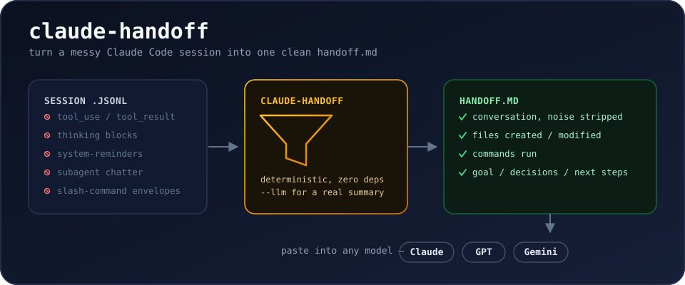

# claude-handoff



[](https://pypi.org/project/claude-handoff/)
[](https://pypi.org/project/claude-handoff/)
[](https://github.com/Vasilispapg/claude-handoff/actions/workflows/ci.yml)
[](https://pypi.org/project/claude-handoff/)
[](LICENSE)

**Summarize & export a Claude Code session into one clean `handoff.md` you can paste into Gemini, GPT, or another Claude — without the noise.**

Claude Code stores every session locally as JSONL (`~/.claude/projects/…/*.jsonl`), full of tool calls, tool results, thinking blocks and system reminders. Existing exporters dump all of that into markdown. `claude-handoff` instead produces a **handoff document**: the actual conversation, what files were touched, what commands ran, and (optionally) an LLM-written summary of goal / decisions / current state / next steps — so the next model can just continue the work.

- **Zero dependencies.** One Python file, stdlib only. Python 3.9+.
- **Deterministic by default.** No API call, no cost, works offline.
- **`--llm` when you want a real summary.** Claude, OpenAI or Gemini via your own API key — or `--llm claude-cli`, which runs your locally-installed Claude Code CLI on your existing Pro/Max plan: **no API key at all**.
- **Noise-free.** Drops tool results, thinking blocks, system reminders, subagent chatter, slash-command envelopes. Keeps user intent, assistant answers, files modified, commands run.

## Install

```bash
pipx install claude-handoff        # or: pip install claude-handoff
brew install Vasilispapg/tap/claude-handoff   # Homebrew
# or just grab the file — it's a single stdlib-only script:
curl -O https://raw.githubusercontent.com/Vasilispapg/claude-handoff/main/claude_handoff.py
python3 claude_handoff.py --list

# tab completion (bash or zsh):
eval "$(claude-handoff --completions zsh)"
```

## Usage

```bash
claude-handoff                     # latest session → handoff.md
claude-handoff -i                  # pick from a numbered list
claude-handoff --list              # what sessions do I have? (title · first prompt)
claude-handoff --name "login bug"  # newest session whose title/prompt matches
claude-handoff "login bug"         # same — a non-path argument is a name search
claude-handoff --project myrepo    # latest session of a specific project
claude-handoff path/to/session.jsonl -o -     # explicit file → stdout
claude-handoff -o clipboard        # straight to the clipboard — go paste it
claude-handoff --last 5            # only the last 5 user turns
claude-handoff --since 2h          # only the last 2 hours of the session
claude-handoff --include-tools     # keep collapsed per-tool-call detail
claude-handoff --include-sidechains  # append subagent (sidechain) work

# claude.ai AND ChatGPT web chats too (each app's data export):
claude-handoff conversations.json --list
claude-handoff conversations.json --name "webhook bug"

# whole project in one handoff, oldest → newest:
claude-handoff --project myrepo --merge

# machine-readable:
claude-handoff --format json -o session.json

# auto-handoff: write one for every session when it ends
claude-handoff --install-hook

# real LLM summary (goal / decisions / current state / next steps):
claude-handoff --llm claude-cli                 # uses your Claude Code login — no API key
claude-handoff --llm ollama                     # local model — fully offline
export ANTHROPIC_API_KEY=sk-...
claude-handoff --llm claude
claude-handoff --llm openai --model gpt-4o
claude-handoff --llm gemini --with-transcript   # summary + cleaned transcript
```

Then paste `handoff.md` into any other model. The document opens with instructions to the receiving assistant, so no extra prompting is needed.

> Auto-selection skips nearly-empty sessions (like the stub `claude /login` leaves behind) so "latest" means your latest *real* conversation. An explicit path or `--name` always wins.

## What the output looks like

```markdown
# Conversation handoff

> To the receiving assistant: … you are taking over …

## Session
- Project: /home/you/myapp (branch main)
- When: 2026-08-20 09:00 → 09:04
- Activity: 2 user messages, 4 assistant replies, 4 tool calls

## Files created / modified
- /home/you/myapp/auth.py

## Commands run
- python -m pytest tests/test_auth.py -q

## Conversation
### 🧑 User
the login breaks on unicode passwords…
### 🤖 Assistant
Found it — ascii encoding. Changed to utf-8, tests pass.
```

## Flags

| Flag | Meaning |
|---|---|
| `--list` | list sessions (date, size, project, title · first prompt); with a `conversations.json`, list its chats |
| `--name QUERY` | pick newest session (or web conversation) whose title/first prompt contains QUERY |
| `--project NAME` | pick latest session whose project path contains NAME |
| `--last N` / `--since 2h` | keep only the tail of the conversation (N user turns / a time window) |
| `--merge` | merge every session in scope into ONE handoff (session-break markers, summed activity) |
| `--format md\|json` | markdown (default) or machine-readable JSON |
| `-o clipboard` | copy the handoff straight to the clipboard |
| `--include-sidechains` | append a section with subagent (sidechain) work |
| `-i` / `--interactive` | pick the session from a numbered list |
| `--install-hook` / `--uninstall-hook` | auto-write a handoff to `~/.claude/handoffs/` when each session ends |
| `--completions bash\|zsh` | print a tab-completion snippet |
| `--mcp` | run as an MCP server over stdio |
| `-o FILE` / `-o -` | output file / stdout (default `handoff.md`) |
| `--include-tools` | collapsed `<details>` blocks with each tool call |
| `--max-chars N` | cap the transcript section (default 80 000; keeps start + recent end) |
| `--any` | ignore the current directory; consider every project's sessions |
| `--llm claude\|openai\|gemini\|claude-cli` | LLM summary instead of raw cleaned transcript |
| `--model ID` | override the LLM model |
| `--focus TEXT` | extra instructions for the summary (e.g. `--focus "emphasize the API decisions"`) |
| `--with-transcript` | with `--llm`, also append the cleaned transcript |
| `--no-redact` | don't strip secret-looking strings before sending to the LLM |
| `--no-cache` | disable the chunk-note cache (`~/.cache/claude-handoff`) |

**API keys** (first set variable wins per provider):

| Provider | Env vars | Notes |
|---|---|---|
| `claude` | `ANTHROPIC_API_KEY` or `CLAUDE_API` | Anthropic API |
| `openai` | `OPENAI_API_KEY` or `GPT_API` | OpenAI API |
| `gemini` | `GEMINI_API_KEY`, `GOOGLE_API_KEY` or `GEMINI_API` | Google AI API |
| `claude-cli` | *(none)* | Shells out to your installed [Claude Code](https://claude.ai/code) CLI; billed to your Pro/Max plan. Run `claude` once to log in. |
| `ollama` | *(none — local)* | Local [Ollama](https://ollama.com) server: fully offline, nothing leaves your machine. `OLLAMA_MODEL` / `OLLAMA_BASE_URL` to configure. |

Nothing is sent anywhere unless you pass `--llm`.

**Where does it look?** Sessions live in Claude Code's global store (`~/.claude/projects`), so you can run `claude-handoff` from anywhere. If your current directory *is* a project (or a subfolder of one), it scopes to that project's sessions; a parent "master folder" scopes to every project under it; `--any` ignores the directory entirely.

**Big sessions & privacy.** Transcripts beyond one pass (~400k chars) are summarized map-reduce style: notes per chunk, then one synthesis — nothing is silently dropped, and finished chunks are cached in `~/.cache/claude-handoff` so an interrupted run resumes for free. Secret-looking strings (API keys, tokens, `password=`…) are redacted before anything is sent to an LLM. In a terminal you get a live progress bar with elapsed time and an ETA:

```text
[█████████░░░░░░░░░░░░░░░] 3/9 chunks | 4m12s elapsed | ~8m left | summarizing part 4/8 (199,867 chars)…
```

Sessions with API `usage` data also get a **Tokens** line in the header (input incl. cache / output). Map-reduce chunks run **4-way parallel** on API providers (`claude`/`openai`/`gemini`); `claude-cli` and `ollama` stay sequential by design.

## MCP server

Any MCP client (Claude Desktop, Claude Code, …) can pull handoffs directly:

```bash
claude mcp add claude-handoff -- claude-handoff --mcp
```

Tools: `list_sessions` (what's on this machine) and `handoff` (build the
document for a session by name/project/path). Deterministic only — an MCP
client never triggers paid LLM calls.

## Roadmap

- Gemini exports as input (Google Takeout ships HTML only — bring a real, redacted export to build against)
- Live token-cost estimates per provider

PRs welcome.

## How it compares

This space isn't empty — it's fragmented. Pick the tool that matches your situation:

- **Exporters** — [claude-conversation-extractor](https://github.com/ZeroSumQuant/claude-conversation-extractor), [claude-code-log](https://github.com/daaain/claude-code-log), [claude-code-transcripts](https://github.com/simonw/claude-code-transcripts), [claude-to-markdown](https://github.com/legoktm/claude-to-markdown) — turn transcripts into readable Markdown/HTML, tool noise included, no handoff framing.
- **Cross-CLI session movers** — [cli-continues](https://github.com/yigitkonur/cli-continues) (`npm i -g continues`) reads 16 coding CLIs' native session stores (Claude Code included) and injects a context doc into another *terminal* tool. Excellent for Claude Code → Codex/Cursor/Gemini CLI; but it can't target web chats, does no LLM summarization, and needs Node 22.5+.
- **In-session handoff skills/plugins** — [thepushkarp/handoff](https://github.com/thepushkarp/handoff), [claude-session-handoff](https://github.com/thenguyenvn90/claude-session-handoff), [claude-code-handoff](https://github.com/Sonovore/claude-code-handoff) — great *if* you remember to run them before the session ends; the model writes the summary using your session's context, and the output targets the next *Claude* session.
- **Browser extensions** — Handoff, LLM Context Bridge, ContextSwitch — transfer *web* chats between ChatGPT/Claude/Gemini; they can't see Claude Code sessions.

`claude-handoff` is the post-hoc, paste-anywhere corner of this map: it works on the JSONL *after* the fact — old sessions, crashed sessions, sessions that hit the usage limit — needs nothing installed in advance, costs zero tokens by default, can write a real summary when you ask for one (`--llm`), and produces a document any receiving model can pick up, including claude.ai, ChatGPT and Gemini in the browser or on your phone.

## Docs

[INDEX.md](INDEX.md) — file map · [docs/DEVELOPMENT.md](docs/DEVELOPMENT.md) — architecture, JSONL schema notes, design decisions · [AGENTS.md](AGENTS.md) — instructions for AI coding agents · [CONTRIBUTING.md](CONTRIBUTING.md) · [CHANGELOG.md](CHANGELOG.md)

## License

MIT

---

mcp-name: io.github.Vasilispapg/claude-handoff
